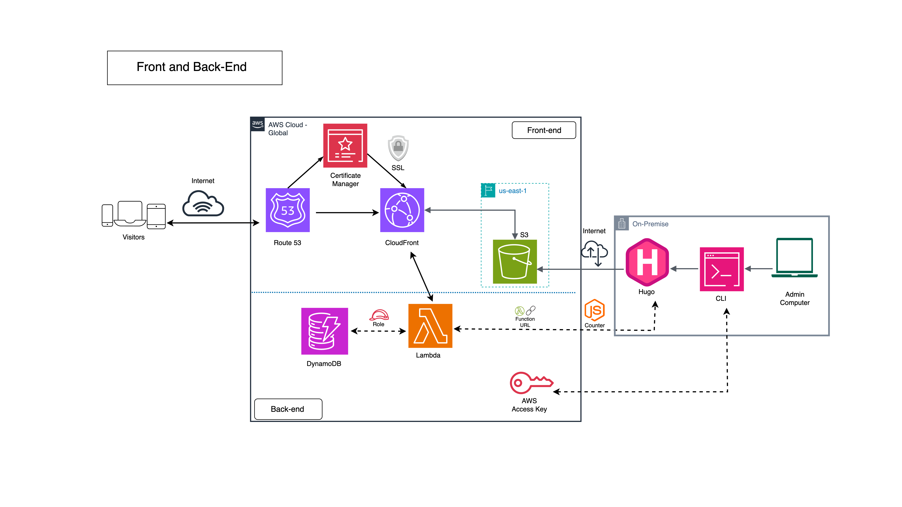

The main goal of the Cloud Resume Challenge is to utilize a wide range of AWS services in our project. While it is actually _enough_ to operate a functional blog using only the infrastructure built in the first leg of this challenge, the project encourages us to test our endurance by creating a simple back-end system to count the number of visitors to our blog.

According to the CRC handbook, this section involves building and linking several key AWS services, such as API Gateway, DynamoDB, and Lambda. However, given the minuscule scale of my project, which doesn’t require many advanced features of API Gateway, I decided to use a Lambda Function URL instead. Considering the scale of my project, I believe using Function URL is also more straightforward and cost-effective compared to API Gateway.

## Create Database
First of all, we need to create a DynamoDB table to store the number of visitors to our website. Then, assign the table an appropriate name and partition key.

To store our future website's visitor data, we can add an additional value inside the table.

## Create Lambda Function
For me, this part is the trickiest step of the Cloud Resume Challenge because it requires writing and testing a Lambda function from scratch multiple times until it finally works. As we all know, one of the most important skills to have in the IT world is the ability to Google well. It’s hard to fully rely on our coding skills alone, so leveraging other people's experience and "suffering" (yes, I mean Stack Overflow) is invaluable. Additionally, it’s perfectly fine to use generative AI to review and improve your code.

After many hours of exploring and testing, here is the code I used for my Lambda function:
```` python
import json

import boto3

from decimal import Decimal

  

dynamodb = boto3.resource('dynamodb')

table = dynamodb.Table('INSERT YOUR DYNAMODB TABLE NAME HERE')

  

def lambda_handler(event, context):

try:

# Fetch the current views count

response = table.get_item(Key={'viewer_id': '1'})

if 'Item' not in response:

return {

"statusCode": 404,

"body": json.dumps({"msg": "Viewer ID not found"})

}

# Convert Decimal to int for JSON serialization

views = int(response['Item'].get('views', 0))

views += 1

# Update the views count

table.update_item(

Key={'viewer_id': '1'},

UpdateExpression='SET #v = :val',

ExpressionAttributeNames={'#v': 'views'},

ExpressionAttributeValues={':val': views}

)

return {

"statusCode": 200,

"body": json.dumps({

"msg": "Hello from Lambda!",

"views": views # Now it's an int, which JSON can serialize

})

}

except Exception as e:

print(f"Error: {str(e)}") # Added logging

return {

"statusCode": 500,

"body": json.dumps({"error": str(e)})

}
````

Since the Cloud Resume Challenge is quite popular among newcomers in cloud computing, there are several code snippets available online. We can adapt and improve them according to our needs. However, it is crucial to understand what the code does and how we can reproduce it in future projects.

## Configure Lambda Function CORS

Considering the scale of my website, I decided to use a Lambda Function URL rather than API Gateway. Therefore, I needed to configure the Cross-Origin Resource Sharing (CORS) settings of my function directly in the function’s configuration pane before pasting the Function URL into my JavaScript file.

The purpose of CORS is to allow specific origin(s) to access a resource—like a Lambda function—through an HTTP-header-based mechanism. To set this up, I specified two versions of my website's address (https://www.farizifs.com and https://farizifs.com) in the Function URL's CORS configuration. This ensures the Function URL only executes after verifying that the request originates from my website.

# Linking Front-End and Back-End
With the two integral parts of the website now complete, the next step is to link them together.

## Create Javascript Counter
The next step is to create a JavaScript file that uses the Lambda function to count, extract, and update the number of visitors, and then reflect that number in the HTML element. This part requires ample time for writing and testing the JavaScript counter file, but I found it less complicated than writing the Python script for the back-end. Once again, Google, Stack Overflow, and (sometimes) LLM chatbots will be your best friends.

```` js
const counter = document.querySelector(".counter-number");

async function updateCounter() {
    try {
        let response = await fetch("PUT YOUR FUNCTION URL HERE/");
        let data = await response.json();
        counter.innerHTML = data.views;  // Assuming your Lambda returns {views: number}
    } catch (error) {
        console.log('Error:', error);
    }
}

updateCounter();
````

Setting this up in a typical single-page HTML website is quite straightforward. I just need to include the JavaScript file and reference it in the index.html file to make it work.

However, since I opted to use Hugo, the process is a bit more complicated:

**First**, place the JavaScript file in the Hugo directory. It’s best to create a dedicated folder for the JS file inside the _assets_ folder in your theme directory.

**Second**, Locate the equivalent of the index.html file in the Hugo directory. In my case, it was baseof.html inside the _layouts_ folder.

**Third**, since I wanted the counter in the footer section of my website, I pinpointed the footer HTML file. For me, it was footer.html inside the layouts/partials directory. Then, I referenced the JS file within this file.

## Final Architecture


With the above architecture, I managed to create a fully functional website that incorporates core AWS services and integrates them with a third-party site generator.

Keep in mind that one of the most important aspects of this project is keeping it as affordable as possible. Apart from spending a few dollars on registering my domain with Route 53, I didn’t incur any other significant expenses.

If you want to take this project further and experiment with additional AWS services, you can incorporate tools like CloudWatch or WAF. Doing so will be worth it if you’re serious about developing your website further.
