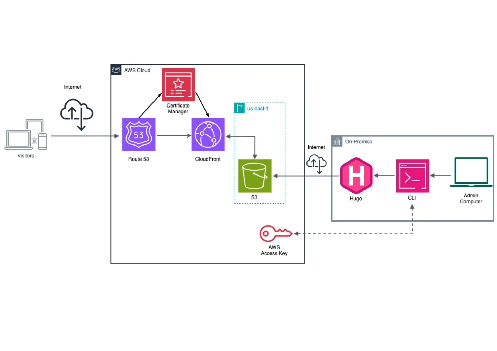

Setting up the front end of my website was perhaps the most enjoyable part of this challenge—not because it was the *easiest*, but because it offered countless opportunities to express myself both technically and aesthetically.  

# Under the Hood  
Once the fun part was over, the next step was ensuring the website was secure, highly available, and easy to update.  

## Select Domain Name and AWS Region  
The first task was to choose a domain name and the AWS region to base the infrastructure in. Adopting a consistent naming convention and noting down the AWS region from the start made the subsequent steps much smoother. I chose the **us-east-1 (Northern Virginia)** region because of its wide range of available services.  

There are many ways to check domain availability, such as using GoDaddy, Namecheap, Cloudflare, or AWS Route 53. To keep things simple, I opted for Route 53 to register and manage my DNS settings, even though it can be slightly pricier.  

## Select Front-End Framework and Install AWS CLI  
For the front end, the most practical approach would be to use HTML and CSS. However, I chose **Hugo** for its long-term benefits, including fast deployment, a wide selection of themes, and markdown compatibility. This decision came with its challenges—I spent several sleepless nights navigating Hugo's documentation and directory structure.  

Eventually, I settled on the [Typo theme](https://github.com/tomfran/typo) by Francesco Tomaselli. After installing the theme, a configuration file named `hugo.toml` was created in the root directory. Ensuring easy access to this file is crucial for future updates. So, I strongly encouraged you to pin your website folder especially if you want to frequently update the content.

You can refer to this [guide](https://docs.aws.amazon.com/cli/latest/userguide/getting-started-install.html) to install AWS CLI based on your respective OS.

## Create an S3 Bucket  
Since S3 bucket names must be globally unique, I named mine based on the domain name and AWS region selected earlier. Three key tasks were necessary after creating the bucket:  
1. Enabling **Static Website Hosting** and specifying the index (e.g., `index.html`) and error documents (e.g., `404.html`).  
2. Allowing public access through both the console and bucket policy.  
3. Noting the "bucket website endpoint" for later use in Hugo deployment.  

## Provision an SSL Certificate  
To secure the website, I used **Amazon Certificate Manager (ACM)** to provision an SSL certificate:  
1. Access ACM in the AWS Console, choose **Request Certificate**, and select **Request Public Certificate**.  
2. Add both versions of the domain name (e.g., `example.com` and `www.example.com`).  
3. Validate the certificate using DNS or email. Route 53 users can conveniently use DNS validation, as Route 53 automates the process.  
4. Submit the request and wait for completion.  

## Set Up a CloudFront Distribution  
**Amazon CloudFront** was configured to enable a content delivery network (CDN) for faster content delivery and enhanced security with HTTPS. Key configurations included:  
1. Selecting the S3 bucket hosting the static website.  
2. Enforcing HTTPS by enabling the redirect from HTTP to HTTPS.  
3. Adding alternate domain names (CNAMEs) for both versions of the domain.  
4. Selecting a suitable price class.  
5. Associating the CloudFront distribution with the SSL certificate.  
6. Noting the CloudFront distribution domain name for future reference.  

## Adjust Hosted Zone Details  
Returning to the hosted zone, I created two DNS records:  
1. A Type A (IPv4) record pointing to the CloudFront distribution.  
2. An alias record for the "www" subdomain pointing to the Type A record above.  

## Update Hugo Configuration File  
To deploy changes seamlessly, I updated the `hugo.toml` file to specify the S3 bucket details:  

````toml
[deployment]
[[deployment.targets]]
# An arbitrary name for this target.
name = "production"

# Amazon Web Services S3; see https://gocloud.dev/howto/blob/#s3
#URL = "s3://<Bucket Name>?region=<AWS region>"
````
## Test and deploy the change
Before deployment, I tested the website locally using the `hugo server` command. Once satisfied with the result, I deployed the changes using `hugo deploy`.

Now, I can inspect the appearance of my website using localhost before deploying them to the S3 bucket.

# Front End Architecture


Above is the architecture of my website after the first leg has been concluded. 

The website is fully functioning, but as the goal of Cloud Resume Challenge is to create a holistic website that comprises of both front end and back end part along with the fully-functioning CI/CD pipeline, the next stage is to develop a simple website visitor counter.


